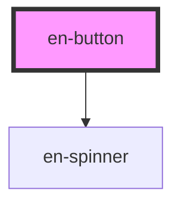

# en-button

<!-- Auto Generated Below -->

## Properties

| Property    | Attribute    | Description                                                                                                                                | Type                                                                                                                                                     | Default     |
| ----------- | ------------ | ------------------------------------------------------------------------------------------------------------------------------------------ | -------------------------------------------------------------------------------------------------------------------------------------------------------- | ----------- |
| `color`     | `color`      | **[DEPRECATED]** Use `variant` com os novos valores semânticos. Mantido por retrocompatibilidade.   | `"danger" \| "default" \| "green" \| "purple"`                                                                                                           | `'default'` |
| `disabled`  | `disabled`   | Desabilita o botão                                                                                                                         | `boolean`                                                                                                                                                | `false`     |
| `fullWidth` | `full-width` | Ocupa 100% da largura do container                                                                                                         | `boolean`                                                                                                                                                | `false`     |
| `loading`   | `loading`    | Exibe spinner de loading no lugar do conteúdo                                                                                              | `boolean`                                                                                                                                                | `false`     |
| `pill`      | `pill`       | Border-radius full — formato pílula                                                                                                        | `boolean`                                                                                                                                                | `false`     |
| `size`      | `size`       | Tamanho do botão (`default` equivale a `md`)                                                                                               | `"default" \| "lg" \| "md" \| "sm"`                                                                                                                      | `'md'`      |
| `type`      | `type`       | Tipo HTML do botão                                                                                                                         | `"button" \| "reset" \| "submit"`                                                                                                                        | `'button'`  |
| `variant`   | `variant`    | Variante visual do botão                                                                                                                   | `"attention" \| "cta" \| "danger" \| "default" \| "ghost" \| "informative" \| "link" \| "negative" \| "positive" \| "primary" \| "secondary" \| "white"` | `'default'` |

## Events

| Event     | Description                                    | Type                      |
| --------- | ---------------------------------------------- | ------------------------- |
| `enClick` | Emitido ao clicar, respeita disabled e loading | `CustomEvent<MouseEvent>` |

## Slots

| Slot       | Description                        |
| ---------- | ---------------------------------- |
|            | Conteúdo do botão (texto ou ícone) |
| `"prefix"` | Ícone antes do texto               |
| `"suffix"` | Ícone após o texto                 |

## Dependencies

### Depends on

- [en-spinner](../en-spinner)

### Graph

----------------------------------------------

*Built with [StencilJS](https://stenciljs.com/)*
