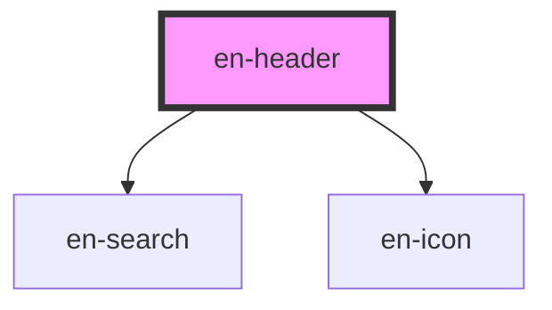

# en-header

<!-- Auto Generated Below -->

## Overview

Header principal do eNotas.

## Properties

| Property            | Attribute            | Description                      | Type                  | Default     |
| ------------------- | -------------------- | -------------------------------- | --------------------- | ----------- |
| `avatarSrc`         | `avatar-src`         | URL do avatar do usuário         | `string \| undefined` | `undefined` |
| `logoAlt`           | `logo-alt`           | Alt text do logo                 | `string`              | `'eNotas'`  |
| `logoSrc`           | `logo-src`           | URL do logo                      | `string \| undefined` | `undefined` |
| `notificationCount` | `notification-count` | Número de notificações não lidas | `number`              | `0`         |
| `showSearch`        | `show-search`        | Exibir campo de busca            | `boolean`             | `true`      |
| `userName`          | `user-name`          | Nome/email do usuário logado     | `string \| undefined` | `undefined` |

## Events

| Event                 | Description | Type                |
| --------------------- | ----------- | ------------------- |
| `enHelpClick`         |             | `CustomEvent<void>` |
| `enLogoClick`         |             | `CustomEvent<void>` |
| `enNotificationClick` |             | `CustomEvent<void>` |
| `enProfileClick`      |             | `CustomEvent<void>` |

## Slots

| Slot        | Description                             |
| ----------- | --------------------------------------- |
| `"actions"` | Ações extras antes dos ícones padrão    |
| `"logo"`    | Substitui o logo padrão                 |
| `"search"`  | Campo de busca (recomendado: en-search) |

## Dependencies

### Depends on

- [en-search](../en-search)
- [en-icon](../en-icon)

### Graph

----------------------------------------------

*Built with [StencilJS](https://stenciljs.com/)*
