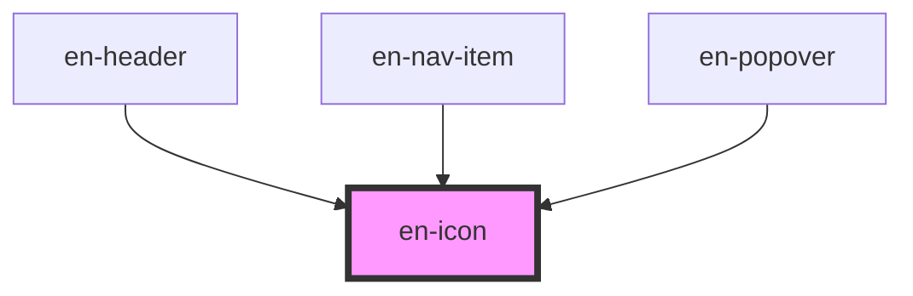

# en-icon

<!-- Auto Generated Below -->

## Properties

| Property            | Attribute | Description                    | Type                                                                                                                                                                                                                                                                                                                                                                                                                                                                                                                                                                                                                                                                                                                                                                                                                                                                                                                                                                                                                                                                                                                                                                                                                                                                                                                                                                                                                                                                                                                                                                                                                                                                                                                                                                                                                                                                                                                                                                         | Default     |
| ------------------- | --------- | ------------------------------ | ---------------------------------------------------------------------------------------------------------------------------------------------------------------------------------------------------------------------------------------------------------------------------------------------------------------------------------------------------------------------------------------------------------------------------------------------------------------------------------------------------------------------------------------------------------------------------------------------------------------------------------------------------------------------------------------------------------------------------------------------------------------------------------------------------------------------------------------------------------------------------------------------------------------------------------------------------------------------------------------------------------------------------------------------------------------------------------------------------------------------------------------------------------------------------------------------------------------------------------------------------------------------------------------------------------------------------------------------------------------------------------------------------------------------------------------------------------------------------------------------------------------------------------------------------------------------------------------------------------------------------------------------------------------------------------------------------------------------------------------------------------------------------------------------------------------------------------------------------------------------------------------------------------------------------------------------------------------------------- | ----------- |
| `label`             | `label`   | Label acessível                | `string \| undefined`                                                                                                                                                                                                                                                                                                                                                                                                                                                                                                                                                                                                                                                                                                                                                                                                                                                                                                                                                                                                                                                                                                                                                                                                                                                                                                                                                                                                                                                                                                                                                                                                                                                                                                                                                                                                                                                                                                                                                        | `undefined` |
| `name` _(required)_ | `name`    | Nome do ícone (conforme Figma) | `"add" \| "alert" \| "alert-circle" \| "archive" \| "arrow-down" \| "arrow-down-2" \| "arrow-left" \| "arrow-left-2" \| "arrow-right" \| "arrow-shuffle" \| "arrow-up" \| "arrow-up-2" \| "block-delete-stop" \| "box" \| "box-2" \| "box-and-star" \| "calculator" \| "calendar-enter-arrow-right" \| "calendar-return-arrow" \| "calendar-schedule-back" \| "calendar-schedule-parevious-date" \| "calendar-tucked-corner" \| "certificate-medal" \| "chart" \| "chart-line" \| "clock" \| "clock-2" \| "clock-time" \| "closed" \| "code" \| "code-document" \| "company" \| "credit-cards" \| "cube" \| "curve-arrow" \| "dashboard" \| "documents-eye" \| "documents-file-pdf" \| "done-check" \| "done-check-circle" \| "done-check-circle-2" \| "download" \| "dual-arrow" \| "earth-world" \| "envelope" \| "equals" \| "exit-door" \| "eye-hidden" \| "eye-show-visible" \| "faq" \| "file-programming-code" \| "filter-sort" \| "grid" \| "grid-layout-add" \| "help" \| "hourglass" \| "house" \| "infornation-info" \| "invoice" \| "invoice-checkmark" \| "invoice-checkmark-with-list" \| "key" \| "less" \| "link" \| "link-shear" \| "mail-open" \| "map" \| "message-question-checkmark" \| "message-smile" \| "messages-chat" \| "news-paper" \| "nf-paper" \| "nfe" \| "nfe-alert" \| "nfe-canceled" \| "nfe-devolution" \| "nfe-done" \| "nfe-history" \| "nfe-split" \| "nfe-transfer" \| "nfe-xml" \| "nfs" \| "nota com cifra" \| "notification" \| "padlock-lock" \| "padlock-unlock" \| "pen" \| "percent" \| "plus-add" \| "power-appliances-shutdown" \| "price" \| "print" \| "question" \| "refresh-rotate" \| "remove-user" \| "robo" \| "rocket" \| "rotate-refresh-loading" \| "search" \| "setting" \| "setting-2" \| "share-arrow" \| "shopping-bag-line" \| "shopping-cart" \| "star" \| "target" \| "thunder" \| "ticket" \| "transfer" \| "trash" \| "user" \| "users" \| "users-profile-group" \| "users-profile-group-2" \| "wallet"` | `undefined` |
| `size`              | `size`    | Tamanho                        | `"12px" \| "16px" \| "20px" \| "24px" \| "8px"`                                                                                                                                                                                                                                                                                                                                                                                                                                                                                                                                                                                                                                                                                                                                                                                                                                                                                                                                                                                                                                                                                                                                                                                                                                                                                                                                                                                                                                                                                                                                                                                                                                                                                                                                                                                                                                                                                                                              | `'16px'`    |

## Dependencies

### Used by

 - [en-header](../en-header)
 - [en-nav-item](../en-nav-item)
 - [en-popover](../en-popover)

### Graph

----------------------------------------------

*Built with [StencilJS](https://stenciljs.com/)*
