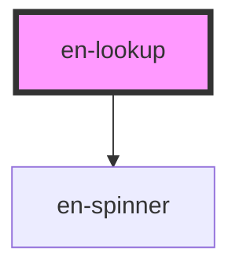

# en-lookup

<!-- Auto Generated Below -->

## Properties

| Property      | Attribute     | Description                                    | Type                                          | Default       |
| ------------- | ------------- | ---------------------------------------------- | --------------------------------------------- | ------------- |
| `disabled`    | `disabled`    | Desabilita o campo                             | `boolean`                                     | `false`       |
| `error`       | `error`       | Mensagem de erro                               | `string \| undefined`                         | `undefined`   |
| `hint`        | `hint`        | Texto auxiliar abaixo do campo                 | `string \| undefined`                         | `undefined`   |
| `label`       | `label`       | Label do campo                                 | `string \| undefined`                         | `undefined`   |
| `loading`     | `loading`     | Exibe spinner e bloqueia interação do dropdown | `boolean`                                     | `false`       |
| `multiple`    | `multiple`    | Permite selecionar múltiplas opções            | `boolean`                                     | `false`       |
| `options`     | --            | Lista de opções disponíveis                    | `LookupOption[]`                              | `[]`          |
| `placeholder` | `placeholder` | Placeholder do input de busca                  | `string`                                      | `'Buscar...'` |
| `value`       | --            | Valor(es) selecionado(s)                       | `LookupOption \| LookupOption[] \| undefined` | `undefined`   |

## Events

| Event            | Description | Type                                          |
| ---------------- | ----------- | --------------------------------------------- |
| `enLookupChange` |             | `CustomEvent<LookupOption \| LookupOption[]>` |
| `enLookupClear`  |             | `CustomEvent<void>`                           |
| `enSearch`       |             | `CustomEvent<string>`                         |

## Dependencies

### Depends on

- [en-spinner](../en-spinner)

### Graph

----------------------------------------------

*Built with [StencilJS](https://stenciljs.com/)*
