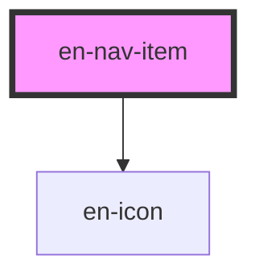

# en-nav-item

<!-- Auto Generated Below -->

## Overview

Item de navegação lateral (sidebar).

## Properties

| Property   | Attribute  | Description                | Type                  | Default     |
| ---------- | ---------- | -------------------------- | --------------------- | ----------- |
| `active`   | `active`   | Estado ativo               | `boolean`             | `false`     |
| `count`    | `count`    | Badge de contagem          | `number \| undefined` | `undefined` |
| `disabled` | `disabled` | Desabilitado               | `boolean`             | `false`     |
| `href`     | `href`     | Href para navegação nativa | `string \| undefined` | `undefined` |
| `icon`     | `icon`     | Nome do ícone (en-icon)    | `string \| undefined` | `undefined` |
| `value`    | `value`    | Valor identificador        | `string \| undefined` | `undefined` |

## Events

| Event         | Description | Type                               |
| ------------- | ----------- | ---------------------------------- |
| `enNavSelect` |             | `CustomEvent<string \| undefined>` |

## Slots

| Slot | Description   |
| ---- | ------------- |
|      | Label do item |

## Dependencies

### Depends on

- [en-icon](../en-icon)

### Graph

----------------------------------------------

*Built with [StencilJS](https://stenciljs.com/)*
