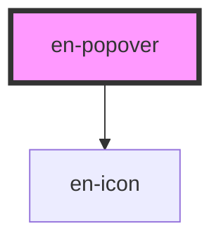

# en-popover

<!-- Auto Generated Below -->

## Overview

Dropdown de opções com trigger via slot.

## Properties

| Property    | Attribute   | Description                              | Type                                                         | Default        |
| ----------- | ----------- | ---------------------------------------- | ------------------------------------------------------------ | -------------- |
| `items`     | --          | Itens do menu                            | `PopoverItem[]`                                              | `[]`           |
| `minWidth`  | `min-width` | Largura mínima do dropdown em px         | `number`                                                     | `200`          |
| `open`      | `open`      | Aberto/fechado (controlado externamente) | `boolean`                                                    | `false`        |
| `placement` | `placement` | Posicionamento relativo ao trigger       | `"bottom-end" \| "bottom-start" \| "top-end" \| "top-start"` | `'bottom-end'` |

## Events

| Event             | Description | Type                       |
| ----------------- | ----------- | -------------------------- |
| `enPopoverClose`  |             | `CustomEvent<void>`        |
| `enPopoverOpen`   |             | `CustomEvent<void>`        |
| `enPopoverSelect` |             | `CustomEvent<PopoverItem>` |

## Slots

| Slot        | Description                                              |
| ----------- | -------------------------------------------------------- |
| `"trigger"` | Elemento que abre/fecha o popover (botão, ícone, avatar) |

## Dependencies

### Depends on

- [en-icon](../en-icon)

### Graph

----------------------------------------------

*Built with [StencilJS](https://stenciljs.com/)*
