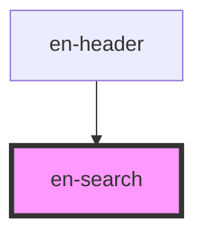

# en-search

<!-- Auto Generated Below -->

## Overview

Campo de busca com ícone integrado e estados visuais.

## Properties

| Property      | Attribute     | Description          | Type                  | Default       |
| ------------- | ------------- | -------------------- | --------------------- | ------------- |
| `disabled`    | `disabled`    | Desabilita o campo   | `boolean`             | `false`       |
| `name`        | `name`        | Nome do campo (form) | `string \| undefined` | `undefined`   |
| `placeholder` | `placeholder` | Placeholder do campo | `string`              | `'Buscar...'` |
| `value`       | `value`       | Valor atual          | `string`              | `''`          |

## Events

| Event      | Description | Type                  |
| ---------- | ----------- | --------------------- |
| `enChange` |             | `CustomEvent<string>` |
| `enClear`  |             | `CustomEvent<void>`   |
| `enInput`  |             | `CustomEvent<string>` |
| `enSearch` |             | `CustomEvent<string>` |

## Dependencies

### Used by

 - [en-header](../en-header)

### Graph

----------------------------------------------

*Built with [StencilJS](https://stenciljs.com/)*
