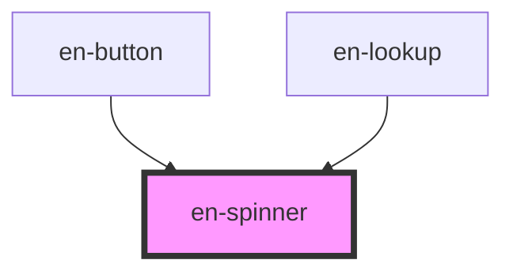

# en-spinner

<!-- Auto Generated Below -->

## Properties

| Property  | Attribute | Description                                    | Type                                                | Default           |
| --------- | --------- | ---------------------------------------------- | --------------------------------------------------- | ----------------- |
| `label`   | `label`   | Label acessível para leitores de tela          | `string`                                            | `'Carregando...'` |
| `size`    | `size`    | Tamanho do spinner (`default` equivale a `md`) | `"default" \| "lg" \| "md" \| "sm" \| "xl" \| "xs"` | `'md'`            |
| `variant` | `variant` | Espessura do traço                             | `"default" \| "thick" \| "thin"`                    | `'default'`       |

## Dependencies

### Used by

 - [en-button](../en-button)
 - [en-lookup](../en-lookup)

### Graph

----------------------------------------------

*Built with [StencilJS](https://stenciljs.com/)*
